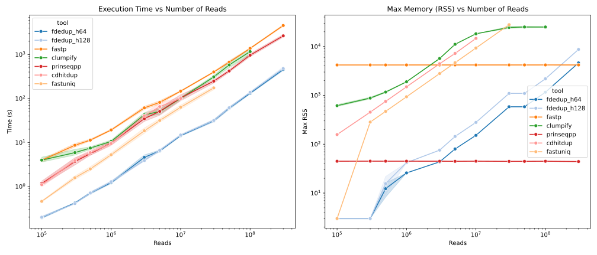

[](https://pixi.sh)

# FastDedup

FastDedup (FDedup) is a fast and memory-efficient FASTX PCR deduplication tool written in Rust.
It utilizes [needletail](https://github.com/onecodex/needletail) for high-performance sequence parsing, [xxh3](https://github.com/DoumanAsh/xxhash-rust) for rapid hashing, and [fxhash](https://github.com/cbreeden/fxhash) for a low-overhead memory cache.



Paper in preparation, you can check it [here](https://gitlab.etu.umontpellier.fr/rapha-l-ribes-m2-internship/fastdedup-paper.git).

## Features

- **Fast & Memory Efficient**: Uses zero-allocation sequence parsing and a non-cryptographic high-speed hashing cache, which automatically scales based on the estimated input file size.
- **Supports Compressed Formats**: Transparently reads both uncompressed and GZIP compressed (`.gz`) FASTQ/FASTA files. Writes to both uncompressed and GZIP compressed formats.
- **Incremental Deduplication & Auto-Recovery**: By default, FDedup appends new sequences to an existing uncompressed output file. It safely pre-loads existing hashes to prevent duplicates. If an uncompressed output file is corrupted due to a previous crash, FDedup automatically truncates it to the last valid sequence and resumes safely.

## Requirements
If you want to build it from source, you need to have the following dependencies installed:
- [Rust](https://rustup.rs/) (>= 1.85)
- [Pixi](https://pixi.sh) (Optional, for running workflows and benchmarks)

## Installation

### From pre-compiled binaries or container images
You can download the latest pre-compiled binaries from the [releases page](https://github.com/RaphaelRibes/FastDedup/releases)

### From bioconda
The recommended way to install FastDedup is with pixi through bioconda:

```bash
pixi add bioconda::fdedup
```

### From Cargo
You can install FastDedup directly from Cargo:

```bash
cargo install fastdedup
```

## CLI Usage

```bash
fdedup [OPTIONS] --input <INPUT>
```

- `-1, --input <INPUT>`: Path to the input FASTA/FASTQ/GZ file (R1 or Single-End).
- `-2, --input-r2 <INPUT_R2>`: Path to the input R2 file (Optional, enables Paired-End mode).
- `-o, --output <OUTPUT>`: Path to the output file (R1 or Single-End). Defaults to `output_R1.fastq.gz`.
- `-p, --output-r2 <OUTPUT_R2>`: Path to the output R2 file (Required if `-2` is provided).
- `-f, --force`: Overwrite the output file if it exists (instead of pre-loading hashes and appending).
- `-v, --verbose`: Print processing stats, such as execution time, number of sequences, and duplication rates.
- `-s, --dry-run`: Calculate duplication rate without creating an output file.
- `-t, --threshold <THRESHOLD>`: Threshold for automatic hash size selection$^1$ (default: 0.001).
- `-H, --hash <HASH>`: Manually specify hash size (64 or 128 bits).
- `-c, --compression <LEVEL>`: GZIP compression level, 1–9 (default: 6).
- `-P, --read-length <LENGTH>`: Expected read length in base pairs, used to tune I/O buffers (default: 150).

1: The probability $p$ of collision is calculated as $p= \frac{x^2}{2 \cdot 2^{64}}$ where $x$ is the estimated number of hashes.
If the probability is higher than the specified threshold, FDedup will automatically switch to 128-bit hashing to nullify the risk of collisions.

> Note: you need $\sqrt{2 \cdot 2^{64} \cdot 10^{-3}} \approx 0.19 \times 10^9$ sequences to have a 1‰ chance of collision with 64-bit hashing, and $0.28 \times 10^{17}$ sequences to have the same chance with 128-bit hashing.

### Run it from Cargo

You can run it directly from Cargo:

```bash
cargo run --release -- --input <INPUT> [OPTIONS]
```

### Run with Pixi

You can also rely on Pixi to run:

```bash
pixi run cargo build --release
pixi run fdedup --input <INPUT> [OPTIONS]
```

### Run with Singularity / Apptainer

You can download the [latest release](https://github.com/RaphaelRibes/FastDedup/releases/tag/v1.0.0) and run the containerized version of FDedup:

Using Apptainer:
```bash
apptainer run fdedup.sif fdedup --input <INPUT> [OPTIONS]
```

Using Singularity:
```bash
singularity run fdedup.sif fdedup --input <INPUT> [OPTIONS]
```

> Note: `--force` is very slow when used in a Singularity container. We recommend just deleting the output file before running the container if you want to start from scratch.

You can build the container yourself using [pixitainer](https://github.com/RaphaelRibes/pixitainer):

1. Install pixitainer:

```bash
pixi global install -c https://prefix.dev/raphaelribes -c https://prefix.dev/conda-forge pixitainer
```

2. Build the container:

```shell
pixi containerize
```

## Recommendations

If you are using FDedup in a pre-processing step, we recommend you to not export your file to a `.gz` format.
Incremental/resumable deduplication, only works with uncompressed output files.
If you output to a compressed format, FDedup requires `--force` to restart from scratch on any subsequent run.
However, if you output to an uncompressed format, FDedup will automatically detect any crash-induced corruption, safely truncate the file to the last valid sequence, and seamlessly resume deduplication.

## To-Do List

- [x] Support for **Paired-End read deduplication**.
- [ ] Add **Multithreading** to parallelize sequence hashing and processing.
- [ ] Support tracking sequence **abundances** (counts) instead of naive discarding.
- [x] Add a possibility for exporting sequences as **FASTA**.
- [ ] Improve error handling.

## License

This project is licensed under the MIT License. See the [LICENSE](LICENSE) file for details.

## Author

[Raphaël Ribes](https://www.raphaelrib.es) (coding and design)

[Céline Mandier](https://gitlab.in2p3.fr/celine.mandier1) (design)

# Acknowledgements

Computations were performed on the ISDM-MESO HPC platform, funded in the framework of State-region planning contracts (Contrat de plan État-région – CPER) by the French Government, the Occitanie/Pyrénées-Méditerranée Region, Montpellier Méditerranée Métropole, and the University of Montpellier.